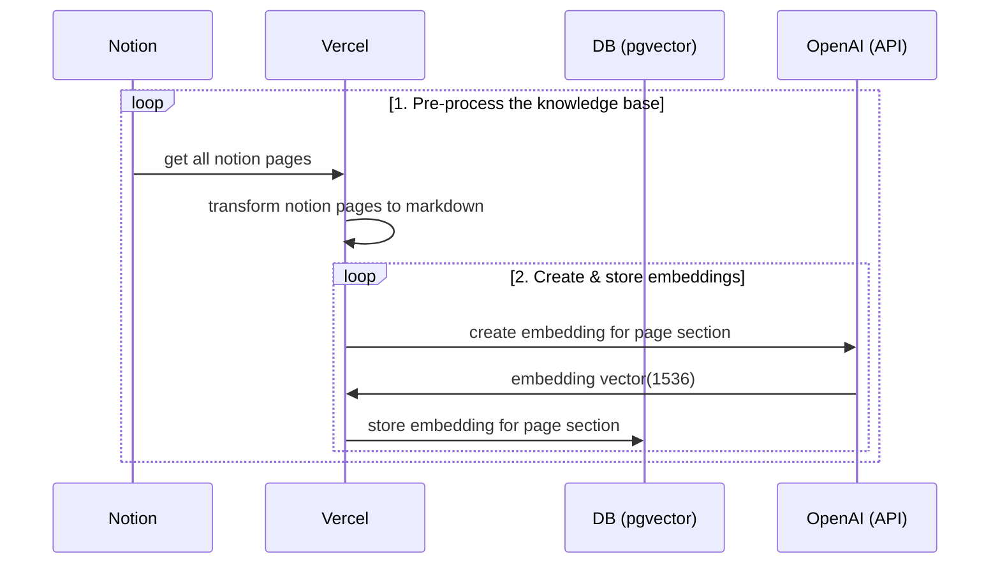

# next-notion-search-openai

An AI powered search starter for Notion. Based on https://github.com/supabase-community/nextjs-openai-doc-search.

## Settings

### Supabase

```shell
# Install Supabase CLI
brew install supabase/tap/supabase

mv .env.example .env

# Start Supabase Docker container
# Copy anon key & service_role key to .env
supabase start

# If you fogert to copy the keys, you can get them with:
supabase status

# migration
supabase migration up
```

### OpenAI

Get your key at https://platform.openai.com/account/api-keys, and set it to `.env` file.

### Notion

Get your key at https://www.notion.so/my-integrations, and set it to `.env` file.

## Install Packages

```shell
pnpm i
```

## Generate Vectors

```shell
pnpm embeddings
```

## Start

```shell
pnpm dev
```

Access http://localhost:3000

## Vectors Generation Flow



## License

This project is licensed under the terms of the [MIT license](/LICENSE).
